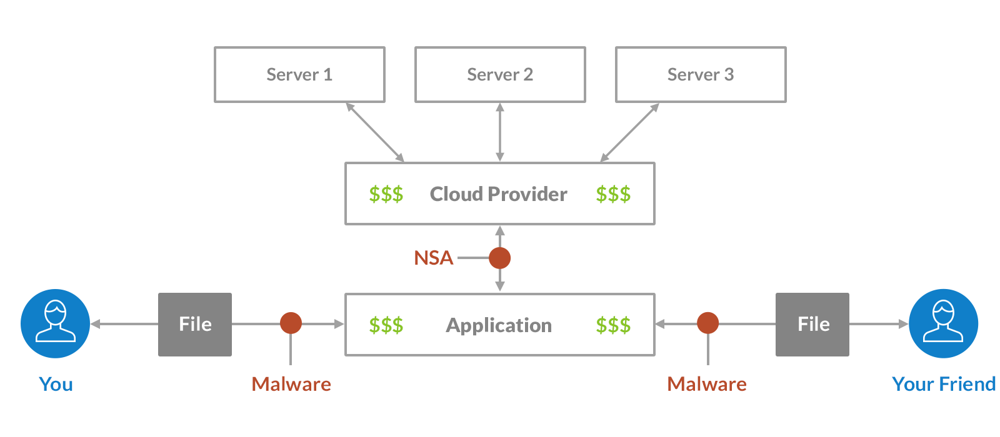
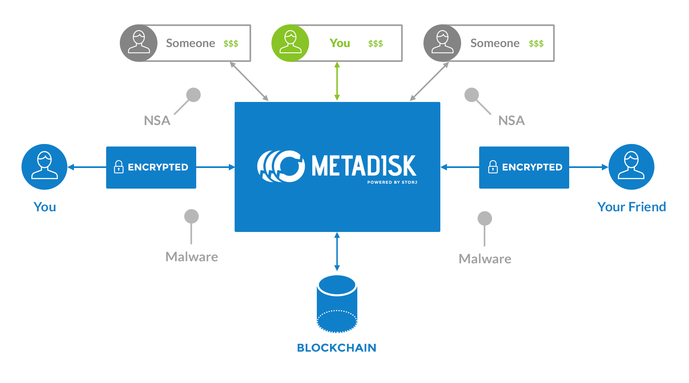
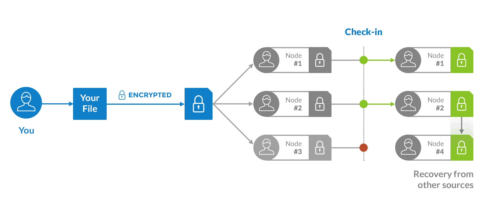
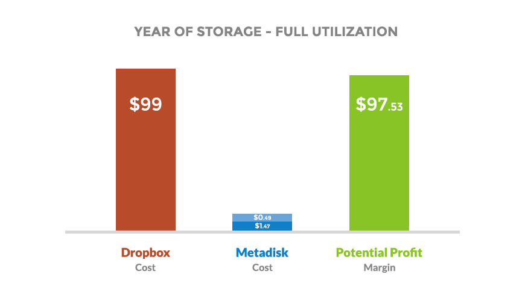
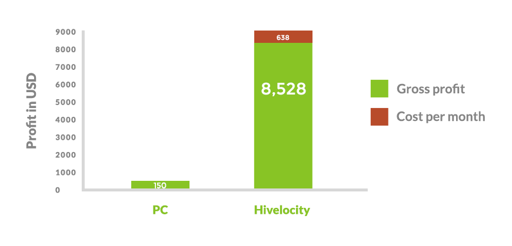
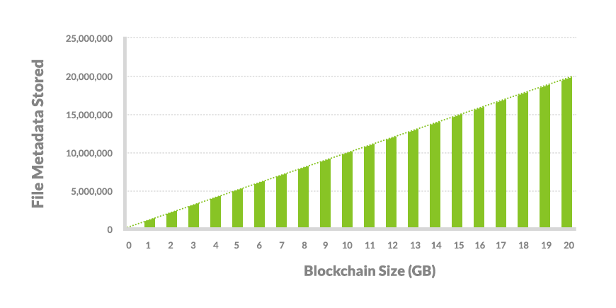

#Metadisk:ブロックチェインベースの分散型ファイルストレージアプリケーション
Shawn Wilkinson + Jim Lowry

shawn@storj.io + jim@storj.io

http://storj.io

http://metadisk.org

2014年8月20日

（訳：2014年11月12日）

##　概要
Metadiskはクラウドストレージをもっと分散型に、もっとセキュアに、そしてもっと効率的にできることを概念的に証明せんがためのオープンソースプロジェクトである。加え、Metadiskは完全な分散型ネットワークのためのプロトタイプのプラットフォームである。この目標遂行のため、技術的でないユーザやネイティブアプリケーションの元となるＡＰＩ、そして将来の拡張のためのインターフェースを与えるＷＥＢアプリケーションを開発することを提案する。ファイルのメタデータのデータ保存として、別のブロックチェーンが使用される一方、暗号通貨はインセンティブ及び支払い機能として役立つ。このアプリケーションは、オープン·ソース·コードを実行するノードのピア·ツー·ピア·ネットワークとして、中央のデータベースというよりは、公開ブロックチェーン上の情報に依存して自律的に動作しようとする。Metadisk主な目的は、Storjと呼ばれるピアツーピアクラウド·ストレージ·ネットワークとして、安定したテストプラットフォームを提供することにある。Metadiskの究極の目的は、伝統的なプラットフォームとユーザーとより簡単に統合できるツールのセットを提供することである。

##1.　はじめに
「クラウドストレージ」は目新しさのために人気の渇望を利用したマーケティング用語である。普通のユーザーにとって、クラウドはインターネット、クライアント·サーバー、またはサービスなどの技術に比べて新しい技術のように聞こえるので、人気を博した。この既存の技術のブランド再生は単なるミスディレクションであり、魔法ではない。データがクラウドに格納される際、クライアントコンピュータからデータセンター内のホストサーバーへTCP/IPを介して転送される。それはメインフレームとダム端末の時代から存在していた古いクライアントサーバーモデルと同じである。そのサーバーは、その後、3つのコピーを作成するという業界標準の冗長性ポリシーに準拠するため、他のサーバーにコピーする。プライベートな情報を委託されている集中型命令を通して実行されるクラウドストレージの現在のモデルは、多くの点で本質的に不安全である。情報泥棒、スパイ、およびセンサーは、政治的戦略、法的戦術、および技術的手段を介してホスト·サーバに保存されたデータをコピー及び破壊することができる。


図1：クラウドアプリケーション用の標準モデル

これらの三つのカテゴリー（訳注：政治的戦略、法的戦術、および技術的手段のこと？）の区別が時間をかけてますますぼやけていった。今、個人のプライバシーや企業情報のセキュリティはオフサイトのデータ·ストアを、それぞれのカテゴリに由来しかつ、（それぞれのカテゴリを）通しての操作される攻撃から保護することができる場合にのみ達成できることは明らかである。

モデル内に構築された、簡単に識別可能な攻撃の中心点は、分権と自動化で解決可能である。現在のクラウドストレージモデルのその他の固有のセキュリティ上の欠陥は、現在広くクラウドストレージサービスに広く使われている支払いメカニズムのタイプである。ほとんどのオンライン決済技術は、支払者と受取人についての情報をストアしリークするため、これらのメカニズムはプライベートでも、情報安全でもない。

私たちは、ホストとクライアントとの間で信頼関係に基づいていないクラウドストレージモデルが必要である。ファイル名、日付、およびその他のメタデータを含むすべてのクライアントの秘密データは、クライアントへのコンピュータからクラウドへの、いかなる転送が行われる前に暗号化されなければならない。政治的または法的攻撃のベクトルを使った攻撃の中心ポイントがあってはいけない。すべてのリソースプロバイダと消費者の両方のインセンティブの支払いは自動化され、匿名の暗号通貨で行われる。その時、クラウドが本当にクラウドとなり、クラウドが構成・移動及び変更されると追加・差し引かれる広大なリソースの水滴が多数構成される。

分散型ストレージ·ネットワークを有効にする包括的な設計原理は数年前から知られている。MaidSafe[1]とTornetのようなプロジェクト[2]は、概説的な実行可能な解決策である。残念ながら、真に分散型ストレージシステムのセキュリティ、スケーラビリティ、コスト効率を実現するには、巨大な技術的な複雑さソフトウェアを必要とする。通信回線、ノード自身どちらも信頼できないので、ノードとネットワークを非常に安全な方法で設計する必要がある。ネットワーク上のノードは、現在の集中型ネットワークの冗長性とパフォーマンスのレベルを達成するために協力しなければならない。さらに、実用的または経済的な側面からソフトウェアはそれ自体で、現在の主要なクラウド·ネットワークから離れた、管理されていない環境で、手動による介入なしで実行する必要がある。

これらの原理は、BitTorrentの同期[3]ビットコイン[4]、公開鍵暗号、及び暗号ハッシュ関数当の既存技術の組み合わせを使用することで達成可能である。既存のオープンソースプロジェクトをモジュール方式で統合することを許すにすることによって、Metadiskは非中央集権的ストレージネットワークの開発を簡素化することを目的としている。このようなネットワークは段階的に、相互運用可能で、幅広いハードウェアをサポートする簡単に交換可能なモジュールで構成されている、既存のクラウドストレージサービスプロバイダが提供しているハードウェアサービスとしてのモデルを含むソフトウェアで構築しなければならない。

Metadiskは、ビットコインが採用したものと同様のインセンティブモデルを使用することができる。ビットコインのマイナーが、ネットワークに暗号ハッシュ資源のパワーに貢献することで、ブロックの報酬を支払われる一方、Metadiskは、ストレージ容量と帯域幅への支払い及び交換に独自の暗号通貨を使用することができる。このモデルは、分散化されたまま、ネットワークを成長と効率に駆動するため、強力な利己主義的自由市場の力を活かす。たとえば、ファイル転送の別のより速い方法が発見されれば、誰かがさらに高速メソッドを生成するまでその方法に向かってネットワークが引き寄せられるであろう。ノードは絶えず変化と競争の激しい環境で働かなければならないことを可能にする。


##2.　概観
Metadiskは、Storjネットワークの開発プラットフォームとしてだけでなく、非技術的なユーザー·インターフェースとして機能する。MetadiskWebインタフェースまたはAPIを使用して、ユーザーがネットワークから自分のファイルを安全にアップロードしたりダウンロードすることができる。ファイルは、クライアント側でアップロード処理中に、ユーザーにより提供される秘密鍵を使用して暗号化される。ユーザーが以前にMetadiskを使用していない場合、Webインターフェイスは秘密鍵を生成する際にユーザを支援するかもしれない。Metadiskは通信利用可能なストレージリソースを見つけるためネットワークと通信し、その後にクラウドストレージの工業規格を考えて３倍の冗長性を保持するため、少なくともファイルを３つの別々の場所に転送する。ユーザやアプリケーションは追加のコストでさらなる冗長性を追加可能である。

私たちは、ユーザがファイルをアップロードした際、アップロードの記録がブロックチェーンに作成される、てブロックチェーンがデータストアとし効率的な機能を提供する記録管理方法を考案した。この機能は、後のメタデータストアとしてブロックチェーンというタイトルのセクションでさらに詳細に説明する。

ファイルが暗号化された後、我々はSHA-256ハッシュを見つける、そのハッシュは一意の識別子やファイルの改ざんを検出する方法の両方として使用する。もし、ファイルがアップロードされた後、ファイルに任意の変更が起これば、ハッシュが異なるであろう。我々は、ファイルに直接アクセスする必要なく、ネットワークがファイルを抜き打ち検査することができるよう、基盤となるプラットフォームStorj[5]で、この事実を利用する。また、クライアントは、ファイルが認証されていること確認するため、ハッシュを使用することもできる。ハッシュ値を生成するために使用される、ファイルの3つの保管場所とともに、ハッシュはブロックチェーンエントリーに保存される。公開鍵の暗号の使用により、ブロックチェーンに挿入されたすべてのメタデータを、不正な読み取りとコピーから保護することができる。ネットワークに入るすべてのデータとメタデータが暗号化され、ハッシュを介してデータを確認することができるため、悪意のある実態がスパイ、偽装、またはデータを変更することはできない。


図2：データストレージのMetadiskモデル


###2.1　セキュリティ
ユーザだけが、特定のファイルの復号鍵へのアクセスを有する。さらに、ファイルを識別するために使用され、一方でストレージ内ではファイルのあとに作成されるファイルのハッシュは、ファイルの内容が安全であることを維持するため暗号化される。そのため、攻撃者は、ファイルの存在を知っていてもネットワーク上のファイルの内容を確認できない。ファイルは送信前に暗号化されているため、Metadiskは人が介在する攻撃にも耐性があり、オープンな暗号化されていない無線LANネットワークを含むネットワークのような、任意の通信上で使用することができるかもしれない。

Metadiskは、さらに安全なデータにクライアント側の暗号化を追加することができるが、ブラウザ内の暗号が実際に安全か議論の余地がある[6]。プライベートでない、または重要でないファイルは従来のモデルで十分である。他のもののには、ファイルを暗号化し、APIを介して渡されることが推奨される。そうすれば、ブラウザの暗号におけるの完全な失敗や、そして完全に危険に晒されたMetadiskノードが、ファイルセキュリティに影響を与えることはない。これは追加のネイティブアプリケーションとツールセットを通じて簡単に達成することができる。

###2.2　冗長性
Metadiskは、ファイルが利用可能および未変更であることを確認するために、データ·ソース上の定期的なチェックを実行する。データソースがこれらのチェックを失敗した場合や使用できない場合は、データを別のデータソースから回収することが可能である。


図3：冗長検査の可視化

###2.3ブートストラッピング
すぐに、Metadiskを立ち上げ実行するために、既存の無料の公共ファイルホストをストレージプロバイダとして使用できるようにしたい。コマンドライン（CLI）の一般的なファイル共有サイト用のダウンロード/アップロードツールであるPlowshare[7]を使用し、我々はこれらのデータソースへのアップロードのタスクを単純化できる。それぞれの、各々の利用規約の互換性を取るまでは、これらのデータソースは、Metadiskのデータソースにとって、ユーザとホストを提供する記憶装置間でデータを行ったり来たり往復するためのノードの動作の維持と帯域幅の限界コストのみ（必要）で、無料である。

無料公開ファイル·ホストは、あっという間にローカルのハードディスクスペースによって打ち負かされるかもしれない。したがって、我々はStorj[5]と呼ばれる私たち自身のプラットフォームを実装しており、Maidsafeと呼ばれる別のプラットフォームに統合することを計画している[1]。これらの両方のプラットフォームは、ユーザーが個人や企業の計算デバイスから、独自のストレージスペースを提供することができ、またストレージ·スペースの分散ネットワークの一部となることができる。これらのプラットフォームは、より直接的にSybil攻撃、冗長性やファイルの整合性、および可用性などの問題に対処する。

Metadiskはプラットフォームに依存しないであることは明らかでなければならない。Metadiskは、それぞれのプラットフォームを単にデータソースとして見る。このようにすれば、エンド·ユーザーとアプリケーションにMetadiskノードの簡略化APIを介しての分散型データ·プラットフォームへのアクセスを与えることができる。


##3　コスト計算
簡単にMetadiskノードをホストできる、VPSプロバイダのデジタルオーシャンを使用した例のテストケースで、私たちはいくつかのコスト見積もりを行うことができる。月額$5で、最大1TBの転送が与えられる[8]。これはフル稼働で、GBあたり約$0.0049ということになる。そのことを考えると、3つの冗長、フル稼働にて$0.49であるので、100GBで保存に$1.47の総費用がかかるであろう。Dropboxは、同じストレージ100GBで$99/年課金する。本質的に、Dropbox99$に対して、年間100ギガバイトのフル稼働で、1.47$プラス転送かかるだろう。使用あたりの支払いモデルを採用することにより、ユーザーが実際には必要ないストレージ·スペースの支払いを避ける。

指数関数的な速度で、記憶媒体の容量が増加し、12ヶ月で倍となる[17]ため、長時間のファイルの保存することと、消費者への1GBあたりの価格を継続的に下げることがクラウドストレージプロバイダの業界標準の慣行になってきている。したがって、100GBフル稼働使用例の下で、最初の年の100GBあたり$1.47のコストは、簡単に$0.74となり、2年後以降、ゼロに近づくかもしれない。記憶媒体のコストが毎年の半分になっても、データセンターの賃料、従業員の給与、会計コスト、規制の負担、弁護士費用等の継続的な運用コストは固定または毎年増加し、そのようなコストのない分散型モデルを打ち負かす能力を制限するので、集中ファイルホストに対して競争力となる。


図4：1年間、フル稼働100GBデータストレージ。ダークブルー　ストレージコスト、ライトブルーMetadiskからのフルデータ取得のための費用


###3.1　コストを削減し、利益を増やす
定額制のノードを使用すると、さらに帯域幅のコストを削減するが、Metadiskノードが生成する大量のデータに対し、ホスティングプロバイダがどのように反応するかは不明瞭である。ノードが削除または破壊された場合、ネットワークまたはファイルの可用性には影響はないので、ノードは、本質的に使い捨てである。特定のノードの破壊に保険をかけるオーバーヘッドを負う必要がなく、ただ継続的に作成するため、使い捨てはコスト削減のたねになる。

ユースケース例のはHivlocity[9]のような定額制の専用サーバープロバイダである。1Gbpsの定額制接続のための手数料は、合計33万GBで推定転送月額638$との推定ができる。再び3冗長とDropboxの価格を使用すると、ノード操作に月額$9166の売上総利益を達成する。明らかに、ネットワークの混雑とプロバイダの隠し最高速度が転送を制限する場合があるが、余裕が大きいので、ネットワークの速度が半分にカットされても、まだかなりの利益が得られる。

ホスティングプロバイダに対してより公平になり、共有ホスティングを乱用避けるために、別の例のユースケースは、Hivelocity[10]のような、定額制の専用サーバープロバイダとする。1Gbpsの定額制接続で推定33万ギガバイト転送し、合計月額$638と推定できる。再び3倍の冗長性とDropboxの価格を使用すると、ノード操作で月額$36666の総利益を達成する。


###3.2　普通のユーザーとサンクコスト(埋没費用）
我々はまた、自分のパソコンから自分のパブリックMetadiskのWebノードを実行している平均的な住宅の高速帯域幅を持つユーザの利益を考慮することができる。この場合、平均データ速度は2.0975MB/s[10]である。Dropboxの価格と3冗長性を用いると、このユーザーは、月額$150の総利益を得るだろう。このケースでは、ユーザーはすでに、インターネット接続とパーソナルコンピュータのために支払うことを選択した。したがってこれらがサンクコストである。
その余分なストレージスペース、電力、および帯域幅の使用が全体のホームコンピューティング予算の総コストのほんのわずかな部分であることを考えると、そのようなユーザににとって限界費用はかなり最小限である。この潜在的利益はMetadiskに、クラウドストレージを大幅にコストダウンすることによってネットワークのすべてのユーザーが利益を得る強力なネットワーク効果をもたらすだろう。

多くの潜在的な住宅のユーザーは技術的観点に対し不快かもしれない。暗号通貨の原理を理解できる上級ユーザーが存在する一方、他は学習曲線を登りたいとは思わないかもしれない。大量の採用を待つ間、急速なネットワークの成長と採用を許容するため、Metadiskの設計と分散型ストレージネットワークが、秘密の詳細で普通のユーザーを混乱させずにユーザーフレンドリーでより高いレベルの抽象化で操作できる、より低いレベルのサービスになるように提案する。


###3.3　サービス例

ハイレベルのサービスの例には、我々はFileBoxと呼ぶこととしが、Dropboxのようなサービスと同様の機能を提供するであろう。FileBoxには、単純な独自のクラウド·ストレージ·ソフトウェア、および競争力あるファイルストレージのレートを持つことができる。バックエンドで、そのようなサービスが被るであろうスタートアップ費用や固定費なしに、FileBoxは完全にMetadiskのノードを通して実行することができる。それ(FileBox)は最もよく使われるファイルのいくつかの独自のキャッシュを保持しながら、そのネットワークの使用のためのクレジットを購入するかもしれない。FileBoxは、MetadiskのノードのStorjネットワークのを使用していることを認識すらしないエンドユーザーに多くの必要な抽象化とシンプルさを提供するであろう。その見返りに、FileBoxは他の集中クラウドストレージプロバイダ上での継続的な利益マージンとともに低い市場参入コストを享受するであろう。トップレベルのソフトウェアのみ維持する必要があり、基盤となるストレージハードウエアを維持する必要はないであろう。


##4　メタデータストアとしてブロックチェーン

Datacoin[11]は、そのブロックチェーンがMetadiskネットワークのためのメタデータストアである、暗号通貨である。これは一時的な措置であり、ある時点でStorjプラットフォーム上のソリューションに置換される。Datacoinでは、データはブロックチェーンに永遠に格納され、トランザクションのハッシュを識別子として使用して取得できる[11]。残念ながら、これはブロックチェーン肥大化として知られている問題につながる。すべての完全なノードは、ブロックチェーン内にすべてのトランザクションのコピーを格納する必要がある。これは、ユーザーそれぞれが数メガバイトのデータを格納すると、ブロックチェーンはあっという間に管理不能なサイズに拡大することを意味する。ただ、１つのムービーファイルを保存すると、アップロードユーザーに数千ドルの価値のDatacoinのコストがかかり、ネットワークを洪水に晒す。


図5：既存の価格設定モデルと費用がかからないプロバイダを使用したMetadiskノードの利益の例

立派なことに、ファイルがDatacoinネットワーク上に格納されると、どのファイルが数学的原理や科学的知識の百科事典のように残り続けなければならないデータに必要かもしれないが、もっと個人的な性質のデータに必要でもスケーラブルでもないか、を検閲することはほぼ不可能である。


###4.1　ブロックチェーン肥大化

ブロックチェーン膨張のため、ブロックチェーン上にファイル自体を格納することは単純には不可能である。代わりに少量のブロックチェーン上の各ファイルに関するメタデータ情報のみを格納することによって、この問題を解決する。これはメタデータを含む、単純なトランザクションを送ることによって行わる。私たちは、そのハッシュ、ファイルの場所、私たちが本質的と考える他の情報を保存することができる。プライバシーとセキュリティ上の理由のためブロックチェーンに挿入する前にこのメタデータを暗号化することができる。このメタデータのサンプルは、このようなものに見えるかもしれない：
```
 1 {
 2  version:"0.1",
 3  datetime:"1391212800",
 4  filesize:"23124",
 5  file_hash:"6e163442e29ec8d7538bc86fe2c4a48778e8ae2254632f0889da753b1c357b1b",
 6  "uploads":[
 7    {"host_name":"mediafire","url":"http://www.mediafire.com/?qorncpzfe74s9"},
 8    {"host_name":"rapidshare","url":"http://rapidshare.com/files/130403982"}
 9  ]
10 }
```
このサンプルメタデータは、アップロードされたファイルサイズに関係なく、約330バイトの情報をを占める。私たちは、500バイト程度の平均的なトランザクションにこれを追加する[12]。いくつかの余分なパディングを追加し、トランザクションごとに約1KBとなる。そのケースでは、ブロックチェーン内のメタデータが1GBのサイズに到達する前に、百万ファイルを格納することができる。さらなる改良によって、チェーンの多重化、ブロックチェーンの切り払い、圧縮を使用して、さらに必要なメタデータ情報量を最小限に抑えることができ,大幅これらの数字（ファイル数）を増やすことができる。


図6：保存されたファイルのメタデータ vs ブロックチェーンサイズ


###4.2　さらなるスケーリング
確かに、初期ネットワークのファイルには合理的であるが、全体のクラウドのデータの全容量を処理するネットワークにとっては、スケーラブルではない。毎秒7トランザクションのSatoshiスタイルのブロックチェーン[13]の制限がボトルネックとなっている。システム利用が増加するにつれて、我々はトランザクションに格納されているすべてのファイルの暗号要約であるmerkle rootを保管する代わりのシステムに移行できる。このようにして、一つのトランザクションで数百万のファイルの存在を証明することができる。この方法では、ビットコインおよび/またはStorjブロックチェーンのセキュリティを直接使用することができる。執筆時点では、我々はNotary Chains[14]といくつかの他のソリューションを模索している。


##5　報酬
できるだけ分散型であるために、我々は、データストアに使用する暗号通貨から、報酬と支払いの暗号通貨を分離する。StorjcoinX、またはSJCXの設計目標は、ある種の正貨として機能することである。これを行うには、すでにビットコインのために開発されているすべての（ビットコインをそのような優れたお金の形にした）コードと機能を取得し、単なる社会的受容を越えて、そのお金を健全性を与えるよう、それらを代替可能価値のある何か、クラウドストレージにより保証を提供するよう拡張する。時間をかけて計画的に、より多くのリソースがStorjネットワークに追加されるに従い、SJCX単位で購入可能なクラウド·ストレージ単位の量が増加し、その（SJCX単位の）価値は増加するよう設計することにより、SJCXはデフレ通貨となる。

SJCXで、ユーザはMetadiskポータルを通じてStorj上の分散ストレージネットワークの帯域幅とストレージの支払いを行うことができる。StorjソフトウェアはSJCX単位で各ストレージと帯域幅単位に対し、価格を設定する自律エージェントのマーケット·メーカーとして動作する。そして、Storjソフトウェアは、定期的にストレージと帯域幅のプロバイダーに、これらのリソースを提供し続けるため、Storjcoin単位を支払うことになる。これらのプログラムされた自動の行動を通して、Storjcoinはユーザーやホスティングプロバイダへのネットワークを維持する価値とインセンティブを提供する自律エージェントとして働く。SJCXの性質と範囲はStorjのホワイトペーパーで説明される。

##6　Proof of Resource(リソース証明)
住宅用高速インターネットで（帯域幅が）21ヶ月ごとに倍増する、というNielsensの法則と、同様に、グローバルストレージ容量が12ヶ月毎に倍増し続けると仮定したKrydersの法則[16]を考慮すると、帯域幅はストレージより逼迫資源になると予測されている。Storjcoin Xが新しい形の正貨として振る舞うという開発目標を維持するために
、Proof of Resource機能を記述する必要がある。より多くのリソース·プロバイがネットワークに接続すれば、Storjcoin X単位で買える、帯域幅に関係したストレージ量は増える。難易度の調整に呼応し、ストレージプロバイダがStorjcoin X単位を得るため一定時間接続しなければならない帯域幅に関係したストレージ量も増加する。

これにより、Bitcoinの価格がBitcoinのマイニングコストにより部分的に決定されるのと同様、自由市場が帯域幅に関係したストレージハードウエアをネットワークに提供することにより、SJCX取得の難易度に基づいてSJCXの価格を設定することができる。

ストレージ証明に、ファイルにシード値を加えたハッシュの手法を使用し、固有のハッシュを生成する定である。シードを与えることにより特定のファイルを持つことを他に証明することができ、もし他のノードがファイルを保有すれば単一の一致するハッシュを生成できる。Proof of Resourceアルゴリズムの完全な技術仕様は、Metadiskを記述する本稿の範囲外であり、Storjのホワイトペーパーでさらに説明されるであろう。

##7　結論
私たちは、ブロックチェーンをバックボーンとして、分散アプリケーションであるMetadiskを活用する新しいモデルを考案した。このアプリケーションは、オープン·ソース·コードを実行するノードのピア·ツー·ピアネットワークなどとして自律的に動作する。我々は、新しいタイプのデータプラットフォームの具体的な導入部分を提供する一方、紛争の調停、Sybil攻撃、Storjプラットフォームの根底にあるセキュリティモデルに関連する未解決の問題を残している。

##参考文献
[1] MaidSafe. Distributed platform, maidsafe, (2014). http://maidsafe.net.

[2] Tornet - generic p2p tools, (2013).https://github.com/bytemaster/tornet.

[3] Bittorrent sync, (2014). http://www.bittorrent.com/sync.

[4] S. Nakamoto. Bitcoin: A peer-to-peer electronic cash system, (2009).https://bitcoin.org/bitcoin.pdf.

[5] Storj - decentralized cloud storage, (2014). http://storj.io/.

[6] Whats wrong with in-browser cryptography?, (2013).http://tonyarcieri.com/whats-wrong-with-webcrypto.

[7] Plowshare - download and upload files from file sharing websites, (2014).https://code.google.com/p/plowshare/.

[8] Pay-as-you-grow pricing, (2014).https://www.digitalocean.com/pricing.

[9] Unmetered dedicated servers, (2014). https://hivelocity.net/dedicated-servers/unmetered-dedicated-servers/.

[10] Download speed by country, (2014).http://www.netindex.com/download/allcountries/.

[11] Datacoin, (2013). http://datacoin.info/index.php?id=index.

[12] Transaction fees, (2014).https://en.bitcoin.it/wiki/Transaction_fees/.

[13] Bitcoin needs to scale by a factor of 1000 to compete with visa. heres howto do it, (2013). http://www.washingtonpost.com/blogs/the-switch/wp/2013/11/12/bitcoin-needs-to-scale-by-a-factor-of-1000-to-compete-with-visa-heres-how-to-do-it/.

[14] Notarychains, (2014). https://github.com/NotaryChains/NotaryChainDocs/blob/master/whitepaper.md.

[15] Nielsen’s law of internet bandwidth, (1998).http://www.nngroup.com/articles/law-of-bandwidth/.

[16] Kryders law, (2005).http://www.chipwalter.com/articles/profiles/kryder.pdf.

